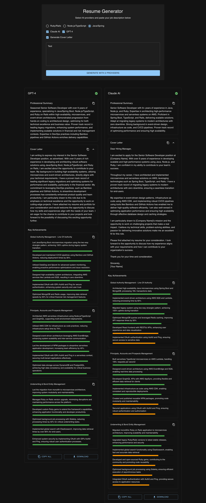

# AI-Powered Resume Builder

A modern web application that leverages AI (Claude and GPT-4) to generate optimized, ATS-friendly resumes based on job descriptions and your project history.

## Features

- 📊 Real-time relevance scoring for achievements
- 🎯 Tech stack-specific resume optimization
- 📝 Professional summary generation
- 💼 Project-based achievement generation
- 📋 Easy copy/paste functionality
- ⬇️ Resume download options
- 🎨 Dark mode UI
- ⚡ Built with React and Material UI

## Getting Started

### Prerequisites

- Node.js (v18 or higher)
- npm or yarn
- API keys for Claude AI and/or OpenAI (GPT-4)

### Installation

1. Clone the repository:
```bash
git clone https://github.com/bTspm/resume-builder.git
cd resume-builder
```

2. Install dependencies:
```bash
npm install
```

3. Create a `.env` file in the root directory:
```env
VITE_CLAUDE_API_KEY=your_claude_api_key
VITE_OPENAI_API_KEY=your_openai_api_key
```

4. Start the development server:
```bash
npm run dev
```

## Configuration

### Tech Stack YAML Files

The application uses YAML files to define your professional experience and projects. These files are located in `src/data/projects/`:

- `java.yml` - Java/Spring Boot experience
- `node.yml` - Node.js/TypeScript experience
- `ruby.yml` - Ruby/Rails experience

#### YAML Structure

```yaml
professional_info:
  company: "Your Company"
  location: "Location"
  total_experience: "X years"
  period: "YYYY-Present"

projects:
  - name: "Project Name"
    period: "YYYY-YYYY"
    type: "Type (e.g., Microservice, Monolith)"
    architecture:
      - type: "Architecture Type"
        pattern: "Design Pattern"
        migration: "Migration Details"
        availability: "Availability Details"
    technical_implementation:
      backend:
        - technology: "Technology Name"
          service_type: "Service Type"
          api: "API Type"
          version_migration: "Migration Details"
      frontend:
        - framework: "Framework Name"
          language: "Programming Language"
      databases:
        - type: "Database Type"
          cache: "Cache Solution"
          search: "Search Engine"
      cloud:
        platform: "Cloud Platform"
        services:
          - "Service 1"
          - "Service 2"
      devops:
        ci_cd:
          - "CI/CD Tool"
        monitoring:
          - "Monitoring Tool"
      security:
        - auth: "Auth Method"
      background_processing:
        - "Processing Tool"
    key_features:
      - "Feature 1"
      - "Feature 2"

core_skills:
  architecture:
    - "Skill 1"
  security:
    - "Skill 1"
  reliability:
    - "Skill 1"
  development:
    - "Skill 1"
  monitoring:
    tools:
      - "Tool 1"
  testing:
    frameworks:
      - "Framework 1"
  devops:
    - "Skill 1"
  productivity_tools:
    - "Tool 1"

leadership:
  technical:
    - "Leadership Skill 1"
  management:
    - "Management Skill 1"
```

## Usage

1. Select your primary tech stack (Java, Node.js, or Ruby)
2. Choose AI providers (Claude AI and/or GPT-4)
3. Paste the job description
4. Click "Generate" to create optimized resumes
5. Compare results from different AI providers
6. Copy individual sections or download the complete resume

## Customization

### Adding New Tech Stacks

1. Create a new YAML file in `src/data/projects/`
2. Update `TechStackSelection.tsx` to include the new option
3. Modify `ProjectLoader.ts` to handle the new YAML file
4. Update the prompt in `resumePrompts.ts` to include stack-specific transformations

### Modifying AI Providers

1. Update `AI_PROVIDERS` in `ai-provider.ts`
2. Implement the provider's API client in `src/api/`
3. Update `ResumeGeneratorService` to handle the new provider

### Customizing the UI

The application uses Material-UI (MUI) for styling. Main customization files:

- `App.tsx` - Theme configuration
- `ResumeForm.tsx` - Input form styling
- `ResumeResultCard.tsx` - Results display
- `ScoreProgressBar.tsx` - Achievement scoring visualization

## Contributing

1. Fork the repository
2. Create a feature branch
3. Commit your changes
4. Push to the branch
5. Create a Pull Request

## Error Handling

The application includes comprehensive error handling:

- API communication errors
- JSON parsing errors
- YAML loading errors
- File processing errors

Check the browser console for detailed error messages during development.

## Dependencies

- React 18
- Material-UI 6
- Zustand (State Management)
- Claude AI / OpenAI APIs
- js-yaml
- TypeScript
- Vite

## Demo
[]